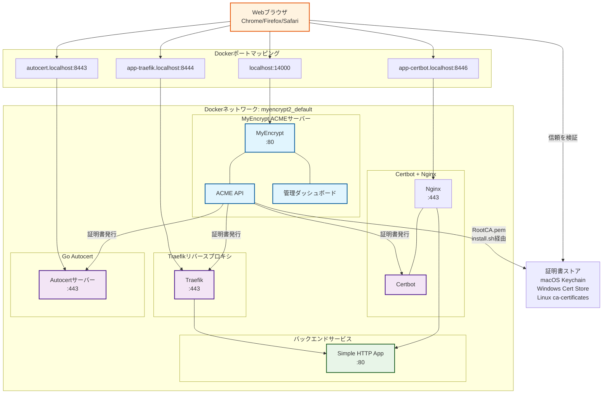
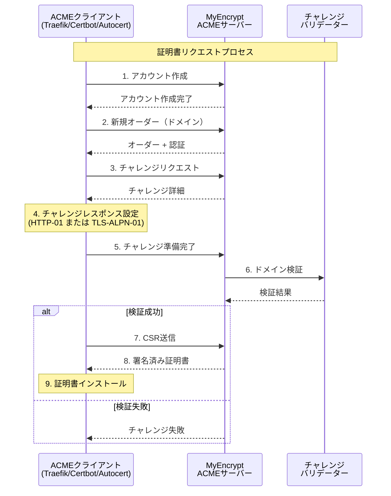

# MyEncrypt - ローカルACME認証局

MyEncryptは、開発環境向けの自動HTTPS証明書管理を提供するローカル開発用ACME認証局です。

## なぜMyEncryptが必要なのか？

Google Chrome、Firefox、Safariなどの現代的なWebブラウザは、`*.localhost`ドメインを内蔵でサポートし、HTTPS証明書を必要とせずにセキュアコンテキストとして扱います。しかし、開発者がローカル開発で実際のHTTPS証明書が必要な場合（SSL/TLS機能のテスト、Service Workerの動作、開発環境と本番環境の一致など）、これらのドメインに対して有効な証明書を取得する簡単な方法がありませんでした。

Let's Encryptなどの従来の認証局は、パブリックインターネット経由でドメイン所有権を検証できないため、localhostドメインに証明書を発行できません。自己署名証明書は動作しますが、手動での信頼設定が必要で、本番環境と同じ証明書チェーン検証を提供しません。

MyEncryptは以下を提供することで、この問題を解決します：

- **ローカルACMEサーバー**: ローカルで動作する完全なRFC 8555準拠のACMEサーバー
- **自動証明書管理**: 既存のACMEクライアント（Certbot、Traefik、autocert）との連携
- **開発-本番環境の一致**: 本番環境と同じ証明書ワークフロー
- **ゼロ設定**: `*.localhost`、`*.test`、その他の開発ドメインで即座に動作
- **完全な証明書チェーン**: テスト用の適切な証明書チェーン検証を提供

### ネットワークアーキテクチャ



## 設定

MyEncryptは`~/.myencrypt/config.yaml`にあるYAML設定ファイルを使用します。ファイルが存在しない場合は、デフォルト値が使用されます。

### デフォルト設定

- ACMEポート: 14000
- 証明書ストレージ: `~/.myencrypt/`
- 個別証明書TTL: 7日
- CA証明書TTL: 800日
- デフォルト許可ドメイン: localhost, *.localhost, *.test, *.example, *.invalid
## インストールと実行

### Docker Composeの使用（推奨）

Docker Composeは、例示統合を含む完全な開発環境を提供するため、MyEncryptを実行する推奨方法です：

```bash
# リポジトリをクローン
git clone https://github.com/shibukawa/myencrypt.git
cd myencrypt

# MyEncryptと例示サービス（Traefik、Certbot+Nginx、Autocert）を開始
docker compose up -d

# MyEncryptサーバーのみ開始
docker compose up -d myencrypt

# ログを表示
docker compose logs -f myencrypt

# サービスを停止
docker compose down
```

#### Docker Composeのカスタマイズ

`compose.yaml`ファイルをカスタマイズするか、環境変数を使用できます：

```bash
# 環境変数でカスタム設定
MYENCRYPT_ALLOWED_DOMAINS="localhost,*.localhost,*.dev,*.local" \
MYENCRYPT_LOG_LEVEL=debug \
docker compose up -d
```

### Docker（スタンドアロン）の使用

本番環境やカスタム設定では、MyEncryptをスタンドアロンDockerコンテナとして実行できます：

```bash
# 最新イメージをプル
docker pull ghcr.io/shibukawa/myencrypt:latest

# 基本設定で実行
docker run -d \
  --name myencrypt \
  -p 14000:80 \
  -e MYENCRYPT_EXPOSE_PORT=14000 \
  -v myencrypt_data:/data \
  ghcr.io/shibukawa/myencrypt:latest

# カスタム設定で実行
docker run -d \
  --name myencrypt \
  -p 14000:80 \
  -e MYENCRYPT_EXPOSE_PORT=14000 \
  -e MYENCRYPT_ALLOWED_DOMAINS="localhost,*.localhost,*.test,*.dev" \
  -e MYENCRYPT_LOG_LEVEL=info \
  -e MYENCRYPT_INDIVIDUAL_CERT_TTL=168h \
  -v myencrypt_data:/data \
  ghcr.io/shibukawa/myencrypt:latest
```

### OSサービスとして実行

MyEncryptは、内蔵の`service`サブコマンドを使用してLinux、macOS、Windowsでシステムサービスとしてインストールおよび実行できます：

```bash
# バイナリをダウンロードしてインストール（Linuxの例）
curl -L https://github.com/shibukawa/myencrypt/releases/latest/download/myencrypt-linux-amd64 -o /usr/local/bin/myencrypt
chmod +x /usr/local/bin/myencrypt

# 設定を初期化（必要に応じてデフォルト設定を作成）
myencrypt init

# OSサービスとしてインストール
myencrypt service install

# サービスを開始
myencrypt service start

# サービスステータスを確認
myencrypt service status
```

#### サービス管理コマンド

| コマンド | 説明 |
|---------|------|
| `service install` | myencryptをOSサービスとしてインストール |
| `service uninstall` | myencrypt OSサービスをアンインストール |
| `service start` | myencryptサービスを開始 |
| `service stop` | myencryptサービスを停止 |
| `service restart` | myencryptサービスを再起動 |
| `service status` | myencryptサービスのステータスを表示 |
| `service run` | myencryptサービスを直接実行（サービスマネージャーが使用） |

#### プラットフォーム別ダウンロード

```bash
# Linux (amd64)
curl -L https://github.com/shibukawa/myencrypt/releases/latest/download/myencrypt-linux-amd64 -o /usr/local/bin/myencrypt

# macOS (amd64)
curl -L https://github.com/shibukawa/myencrypt/releases/latest/download/myencrypt-darwin-amd64 -o /usr/local/bin/myencrypt

# Windows (PowerShell)
Invoke-WebRequest -Uri "https://github.com/shibukawa/myencrypt/releases/latest/download/myencrypt-windows-amd64.exe" -OutFile "C:\Program Files\MyEncrypt\myencrypt.exe"
```

サービスコマンドは、サポートされているすべてのプラットフォーム（Linux systemd、macOS launchd、Windows Service Manager）で一貫して動作します。

### ソースからビルド（開発用）

開発やカスタムビルドの場合：

```bash
# 前提条件: Go 1.21+が必要
git clone https://github.com/shibukawa/myencrypt.git
cd myencrypt

# アプリケーションをビルド
go build -o myencrypt cmd/myencrypt/main.go

# 開発モードで実行（設定ファイル + 環境変数を使用）
./myencrypt run

# カスタム設定で実行
./myencrypt run --config /path/to/config.yaml

# 異なるプラットフォーム用にビルド
GOOS=linux GOARCH=amd64 go build -o myencrypt-linux-amd64 cmd/myencrypt/main.go
GOOS=darwin GOARCH=amd64 go build -o myencrypt-darwin-amd64 cmd/myencrypt/main.go
GOOS=windows GOARCH=amd64 go build -o myencrypt-windows-amd64.exe cmd/myencrypt/main.go
```
## Docker設定

Dockerモードで実行する場合、MyEncryptは：
- 内部的にポート80でリッスン（Docker ネットワーク内での`http://myencrypt`アクセス用）
- ホストアクセス可能ポートを指定するために`MYENCRYPT_EXPOSE_PORT`環境変数が必要
- Docker run/compose設定で指定されたホストポートに内部ポート80をマップ

### 環境変数

| 変数 | デフォルト | 説明 |
|------|-----------|------|
| `MYENCRYPT_EXPOSE_PORT` | - | **必須**: ホストアクセス可能ポート番号 |
| `MYENCRYPT_ALLOWED_DOMAINS` | `localhost,*.localhost,*.test,*.example,*.invalid` | 許可ドメインのカンマ区切りリスト |
| `MYENCRYPT_INDIVIDUAL_CERT_TTL` | `168h` | 証明書有効期間 |
| `MYENCRYPT_CA_CERT_TTL` | `19200h` | CA証明書有効期間（800日） |
| `MYENCRYPT_CERT_STORE_PATH` | `/data` | 証明書保存ディレクトリ |
| `MYENCRYPT_DATABASE_PATH` | `/data/myencrypt.db` | SQLiteデータベースパス |
| `MYENCRYPT_LOG_LEVEL` | `info` | ログレベル（debug, info, warn, error） |

### Dockerの設定例

#### 基本設定
```bash
docker run -p 14000:80 \
  -e MYENCRYPT_EXPOSE_PORT=14000 \
  -v myencrypt_data:/data \
  ghcr.io/shibukawa/myencrypt:latest
```

#### デバッグログ付き開発設定
```bash
docker run -p 14000:80 \
  -e MYENCRYPT_EXPOSE_PORT=14000 \
  -e MYENCRYPT_LOG_LEVEL=debug \
  -e MYENCRYPT_INDIVIDUAL_CERT_TTL=168h \
  -v myencrypt_data:/data \
  ghcr.io/shibukawa/myencrypt:latest
```

#### カスタムドメイン設定
```bash
docker run -p 14000:80 \
  -e MYENCRYPT_EXPOSE_PORT=14000 \
  -e MYENCRYPT_ALLOWED_DOMAINS="localhost,*.localhost,*.dev,*.local,myapp.test" \
  -v myencrypt_data:/data \
  ghcr.io/shibukawa/myencrypt:latest
```

## サービス通信アーキテクチャ

### ACME証明書フロー



### サービス詳細

| サービス | 内部ポート | 外部ポート | ドメイン | 目的 |
|---------|-----------|-----------|---------|------|
| **MyEncrypt** | 80 | 14000 | localhost | ACME CAサーバー、管理ダッシュボード |
| **Traefik** | 80/443/8080 | 8081/8444/8082 | app-traefik.localhost<br>traefik.localhost | 自動HTTPS付きリバースプロキシ |
| **Certbot+Nginx** | 80/443 | 8085/8446 | app-certbot.localhost | 従来のACMEクライアント + Webサーバー |
| **Autocert** | 443 | 8443 | autocert.localhost | 組み込みACME付きGoアプリケーション |
| **Simple HTTP App** | 80 | - | - | バックエンドアプリケーション（Traefikで共有） |

### 現在のサービス状況（検証済み）

| サービス | 状況 | 証明書発行者 | TLSバージョン | チャレンジタイプ |
|---------|------|------------|-------------|----------------|
| **MyEncrypt** | ✅ 実行中 | 自己（CA） | - | - |
| **Traefik** | ✅ 実行中 | MyEncrypt CA | TLSv1.3 | TLS-ALPN-01 |
| **Certbot+Nginx** | ✅ 実行中 | MyEncrypt CA | TLSv1.3 | HTTP-01 |
| **Autocert** | ✅ 実行中 | MyEncrypt CA | TLSv1.3 | TLS-ALPN-01 |
| **Simple HTTP App** | ✅ 実行中 | - | - | - |

### 検証済みHTTPSエンドポイント

すべてのエンドポイントはMyEncrypt CA証明書検証でテスト済みです：

```bash
# CA証明書をダウンロード
curl -s http://localhost:14000/download/certificate -o myencrypt-ca.pem

# セキュア接続をテスト
curl --cacert myencrypt-ca.pem --resolve app-traefik.localhost:8444:127.0.0.1 https://app-traefik.localhost:8444/
curl --cacert myencrypt-ca.pem --resolve traefik.localhost:8444:127.0.0.1 https://traefik.localhost:8444/
curl --cacert myencrypt-ca.pem --resolve app-certbot.localhost:8446:127.0.0.1 https://app-certbot.localhost:8446/
curl --cacert myencrypt-ca.pem --resolve autocert.localhost:8443:127.0.0.1 https://autocert.localhost:8443/
```

### セキュリティ機能

- **CA証明書検証**: `http://localhost:14000/download/certificate`からCA証明書をダウンロード
- **TLS 1.3暗号化**: すべてのHTTPS接続で最新のTLSプロトコルを使用
- **証明書チェーン**: 完全な証明書チェーン（サーバー証明書 + CA証明書）を提供
- **ドメイン検証**: 適切なSubject Alternative Name（SAN）設定
- **自動更新**: サービスは期限切れ前に証明書を自動更新
## 例

プロジェクトには、異なるWebサーバーとACMEクライアントでMyEncryptを使用する方法を示すいくつかの例示統合が含まれています：

### 1. Traefik統合（`examples/traefik/`）
- **Webサーバー**: Traefik（リバースプロキシ）
- **ACMEクライアント**: 内蔵Traefik ACME
- **チャレンジタイプ**: TLS-ALPN-01
- **アクセス**: https://traefik.localhost:8444/
- **機能**: 自動証明書管理、ダッシュボード、ロードバランシング

### 2. Certbot + Nginx統合（`examples/certbot-nginx/`）
- **Webサーバー**: Nginx
- **ACMEクライアント**: Certbot（公式Let's Encryptクライアント）
- **チャレンジタイプ**: HTTP-01（webroot）
- **アクセス**: https://app-certbot.localhost:8446/
- **機能**: 従来の設定、手動証明書管理、高性能

### 3. Go autocert統合（`examples/autocert/`）
- **Webサーバー**: Go HTTPサーバー
- **ACMEクライアント**: golang.org/x/crypto/acme/autocert
- **チャレンジタイプ**: TLS-ALPN-01
- **アクセス**: https://autocert.localhost:8443/
- **機能**: 組み込みGoアプリケーション、自動証明書キャッシュ

### 既知の非互換性

#### Caddy Webサーバー

CaddyはMyEncryptのアーキテクチャとの互換性問題により、例に含まれていません：

- **問題**: CaddyはACME CAサーバー自体がHTTPS経由でアクセス可能であることを要求
- **MyEncryptの設計**: シンプルさとブートストラップ証明書問題回避のためHTTP（ポート14000）で動作
- **回避策の複雑さ**: MyEncryptのHTTPS設定には追加の証明書管理が必要で、シンプルなローカルCAの目的に反する

この設計判断は、汎用互換性よりも設定の簡単さと運用を優先しています。他のほとんどのACMEクライアント（Traefik、Certbot、autocert）は、HTTPベースのACMEサーバーとシームレスに動作します。

## 例の実行

### サービスの開始

すべての例を開始：
```bash
docker compose up -d
```

特定の例を開始：
```bash
# Traefikのみ
docker compose up -d traefik.localhost

# Certbot + Nginxのみ
docker compose up -d app-certbot.localhost

# Go autocertのみ
docker compose up -d autocert.localhost
```

### OSへのCA証明書インストール

ブラウザのセキュリティ警告を回避するため、自動インストールスクリプトを使用してMyEncrypt CA証明書をオペレーティングシステムの証明書ストアにインストールします：

#### macOS/Linux インストールスクリプト

```bash
# インストールスクリプトをダウンロードして実行
curl -s http://localhost:14000/download/install.sh | bash
```

#### Windows インストールスクリプト

```powershell
# インストールスクリプトをダウンロードして実行（PowerShell）
Invoke-WebRequest -Uri "http://localhost:14000/download/install.ps1" -UseBasicParsing | Invoke-Expression
```

#### CA証明書のアンインストール

MyEncrypt CA証明書を削除する必要がある場合：

##### macOS/Linux アンインストールスクリプト

```bash
# アンインストールスクリプトをダウンロードして実行
curl -s http://localhost:14000/download/uninstall.sh | bash
```

##### Windows アンインストールスクリプト

```powershell
# アンインストールスクリプトをダウンロードして実行（PowerShell）
Invoke-WebRequest -Uri "http://localhost:14000/download/uninstall.ps1" -UseBasicParsing | Invoke-Expression
```

### HTTPS接続のテスト

CA証明書をインストール後、サービスに安全にアクセスできます：

```bash
# curlでテスト（CA証明書使用）
curl --cacert myencrypt-ca.pem https://app-traefik.localhost:8444/
curl --cacert myencrypt-ca.pem https://app-certbot.localhost:8446/
curl --cacert myencrypt-ca.pem https://autocert.localhost:8443/

# OSインストール後、--cacertなしで動作するはず
curl https://app-traefik.localhost:8444/
curl https://app-certbot.localhost:8446/
curl https://autocert.localhost:8443/
```

### ブラウザアクセス

CA証明書をOSにインストールすると、セキュリティ警告なしでブラウザでサービスにアクセスできます：

- **Traefikダッシュボード**: https://traefik.localhost:8444/
- **Traefikアプリ**: https://app-traefik.localhost:8444/
- **Certbot + Nginx**: https://app-certbot.localhost:8446/
- **Go Autocert**: https://autocert.localhost:8443/
- **MyEncryptダッシュボード**: http://localhost:14000/

#### macOS Safari互換性の注意

**macOSユーザーへの重要な注意**: Chrome、Firefox、Edgeは`*.localhost`ドメインをlocalhostとして透過的に処理しますが、Safariはこの機能をサポートしていません。

Safariユーザーには2つのオプションがあります：

##### オプション1: 手動/etc/hostsエントリ
```bash
# 各ドメインを個別に/etc/hostsに追加
sudo tee -a /etc/hosts > /dev/null <<EOF
127.0.0.1 traefik.localhost
127.0.0.1 app-traefik.localhost
127.0.0.1 app-certbot.localhost
127.0.0.1 autocert.localhost
EOF
```

##### オプション2: dnsmasqによるワイルドカードDNS
```bash
# Homebrewでdnsmasqをインストール
brew install dnsmasq

# *.localhostドメイン用のdnsmasq設定
echo 'address=/.localhost/127.0.0.1' >> $(brew --prefix)/etc/dnsmasq.conf

# dnsmasqサービス開始
sudo brew services start dnsmasq

# macOSが.localhostドメインでdnsmasqを使用するよう設定
sudo mkdir -p /etc/resolver
echo 'nameserver 127.0.0.1' | sudo tee /etc/resolver/localhost
```

いずれかの設定後、Safariは`*.localhost`ドメインに適切にアクセスできるようになります。

### CA証明書のアンインストール

MyEncrypt CA証明書を削除する必要がある場合：

#### macOS
```bash
# システムキーチェーンから削除
sudo security delete-certificate -c "MyEncrypt Development CA (myencrypt)" /Library/Keychains/System.keychain

# ユーザーキーチェーンから削除
security delete-certificate -c "MyEncrypt Development CA (myencrypt)" ~/Library/Keychains/login.keychain
```

#### Linux（Ubuntu/Debian）
```bash
# 証明書ファイルを削除
sudo rm -f /usr/local/share/ca-certificates/myencrypt-ca.crt

# 証明書ストアを更新
sudo update-ca-certificates --fresh
```

#### Linux（CentOS/RHEL/Fedora）
```bash
# 証明書ファイルを削除
sudo rm -f /etc/pki/ca-trust/source/anchors/myencrypt-ca.crt

# 証明書ストアを更新
sudo update-ca-trust
```

#### Windows（管理者権限のPowerShell）
```powershell
# 信頼されたルート証明機関から削除
Get-ChildItem -Path "Cert:\LocalMachine\Root" | Where-Object {$_.Subject -match "MyEncrypt Development CA"} | Remove-Item
```
## 開発状況

MyEncryptは、以下の実装済み機能を持つ完全に機能するローカルACME認証局です：

- ✅ 完全なACMEプロトコル実装（RFC 8555）
- ✅ HTTP-01およびTLS-ALPN-01チャレンジサポート
- ✅ SQLiteベースの証明書とアカウント管理
- ✅ Webベース管理ダッシュボード
- ✅ 環境変数設定付きDockerコンテナ化
- ✅ 統合例（Traefik、Certbot+Nginx、Go autocert）
- ✅ 証明書失効とアカウント管理
- ✅ 自動証明書更新サポート

## mkcertとの比較

MyEncryptは[mkcert](https://github.com/FiloSottile/mkcert)からインスパイアされ、いくつかの類似した目標を共有していますが、ローカル証明書管理に対して異なるアプローチを取っています：

### 類似点

- **同じ証明書ストア**: MyEncryptはmkcertと同じシステム証明書ストア（macOS Keychain、Windows Certificate Store、Linux ca-certificates）にCA証明書をインストールできます
- **ローカル開発フォーカス**: 両ツールともローカル開発環境向けに設計されています
- **信頼された証明書**: 両方ともブラウザとアプリケーションで信頼される証明書を作成します

### 主な違い

| 機能 | mkcert | MyEncrypt |
|------|--------|-----------|
| **証明書配布** | 手動ファイル生成 | ACMEプロトコル経由で自動 |
| **統合** | 直接ファイル配置 | 既存のACMEクライアントと連携 |
| **サーバーコンポーネント** | なし（CLIツールのみ） | Web ダッシュボード付き完全ACMEサーバー |
| **証明書管理** | 手動更新 | ACME経由で自動更新 |
| **証明書寿命** | 長期間（年単位） | 短期間（デフォルト7日） |
| **証明書永続性** | 永続ファイル | 揮発性、自動更新 |
| **デプロイメント** | システムインストール必須 | システム変更なしでDockerで実行可能 |
| **プロトコル** | カスタムツール | 標準ACME（RFC 8555） |
| **本番環境との一致** | 異なるワークフロー | 本番CAと同じワークフロー |

### どちらを使うべきか

#### mkcertを使う場合：
- ✅ シンプルな一回限りの証明書生成が必要
- ✅ 直接ファイルベースの証明書管理を好む
- ✅ 自動更新が不要
- ✅ 最小限のシステムフットプリントを求める
- ✅ ACME非対応のアプリケーションを使用

#### MyEncryptを使う場合：
- ✅ 自動証明書管理が必要
- ✅ ACME対応ツール（Traefik、Certbot、autocert）を使用
- ✅ 証明書の自動更新が必要
- ✅ 開発-本番環境のワークフロー一致を求める
- ✅ コンテナ化されたデプロイメントを好む
- ✅ 証明書管理のWebダッシュボードが必要
- ✅ 共有インフラでのチーム環境で作業

### システム統合

#### CA証明書インストール
両ツールともシステム証明書ストアにCA証明書をインストールできますが、アプローチが異なります：

**mkcert**: 自動システム統合
```bash
mkcert -install  # システムストアに自動インストール
```

**MyEncrypt**: 生成されたスクリプト経由での手動インストール
```bash
# インストールスクリプトをダウンロードして実行
curl -s http://localhost:14000/install/script | bash

# または手動インストール
curl -s http://localhost:14000/download/certificate -o myencrypt-ca.pem
# その後、システム証明書ストアに手動追加
```

#### 証明書配布

**mkcert**: 直接ファイル生成
```bash
mkcert example.localhost  # example.localhost.pemとexample.localhost-key.pemを作成
```
- 長期間有効な証明書（通常は年単位）
- ディスク上に永続ファイルとして保存
- 証明書期限切れ時は手動更新が必要

**MyEncrypt**: ACMEプロトコル統合
```bash
# ACMEクライアントで自動動作
certbot certonly --server http://localhost:14000/acme/directory -d example.localhost
```
- 短期間有効な証明書（デフォルト7日、設定可能）
- 揮発性で期限切れ前に自動更新
- 永続的な証明書ファイルなし - ACMEクライアントが完全管理
- 頻繁な更新サイクルで本番CA慣行に従う

### デプロイメント柔軟性

**mkcert**: システムインストール必須
- 各開発マシンにインストールが必要
- CA証明書をシステム全体にインストールが必要
- 直接システム統合が必要

**MyEncrypt**: 柔軟なデプロイメントオプション
- Dockerコンテナとして実行可能（システムインストール不要）
- システムサービスとして実行可能
- ソースから実行可能
- CA証明書インストールはオプション（手動スクリプト提供）

これにより、MyEncryptは特に以下に適しています：
- **チーム環境**: すべての開発者マシンでシステムレベル変更を避けたい場合
- **CI/CD環境**: 自動化された証明書管理が必要な場合
- **コンテナ化開発**: ツールを分離して保持したい場合
- **本番環境類似テスト**: 本番環境と同じACMEワークフローを使用したい場合

## ライセンス

MyEncryptはGNU Affero General Public License v3.0（AGPL-3.0）の下でライセンスされています。

これは以下を意味します：
- ✅ このソフトウェアを自由に使用、修正、配布できます
- ✅ 商用目的で使用できます
- ⚠️ このソフトウェアを修正してサーバーで実行する場合、ユーザーにソースコードを提供する必要があります
- ⚠️ 派生作品もAGPL-3.0の下でライセンスする必要があります
- ⚠️ ネットワーク使用は配布とみなされます - ソースコードを利用可能にする必要があります

完全なライセンステキストについては、[LICENSE](LICENSE)ファイルを参照してください。

### なぜAGPL？

AGPLライセンスは、ソフトウェアがネットワークサービスとして使用される場合でも、MyEncryptの改良がオープンソースのままであることを保証します。これにより、コミュニティの協力が促進され、エコシステムに貢献しないプロプライエタリなフォークが防止されます。

## 貢献

貢献を歓迎します！貢献がAGPL-3.0ライセンスと互換性があることを確認してください。

1. リポジトリをフォーク
2. 機能ブランチを作成
3. 変更を行う
4. 該当する場合はテストを追加
5. プルリクエストを送信

## サポート

- 📖 ドキュメント: このREADMEとインラインコードコメントを参照
- 🐛 バグレポート: [GitHub Issues](https://github.com/shibukawa/myencrypt/issues)
- 💬 ディスカッション: [GitHub Discussions](https://github.com/shibukawa/myencrypt/discussions)

---

Copyright (C) 2025 Yoshiki Shibukawa

このプログラムはフリーソフトウェアです：Free Software Foundationによって公開されたGNU Affero General Public Licenseの条項の下で、ライセンスのバージョン3、または（あなたの選択により）それ以降のバージョンのいずれかの下で、これを再配布および/または修正することができます。

このプログラムは有用であることを願って配布されていますが、いかなる保証もありません。商品性や特定の目的への適合性の暗黙の保証さえもありません。詳細については、GNU Affero General Public Licenseを参照してください。
