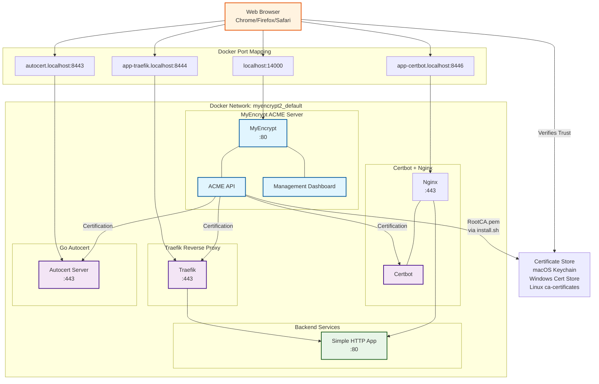
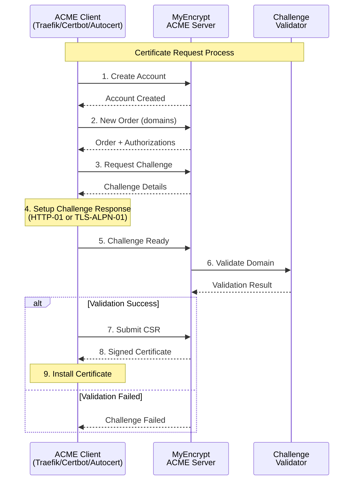

# MyEncrypt - Local ACME Certificate Authority

MyEncrypt is a local development ACME certificate authority that provides automatic HTTPS certificate management for development environments.

## Why MyEncrypt?

Modern web browsers like Google Chrome, Firefox, and Safari have built-in support for `*.localhost` domains, treating them as secure contexts without requiring HTTPS certificates. However, when developers need actual HTTPS certificates for local development - whether for testing SSL/TLS functionality, working with service workers, or ensuring development environments match production - there was no easy way to obtain valid certificates for these domains.

Traditional certificate authorities like Let's Encrypt cannot issue certificates for localhost domains since they cannot validate domain ownership over the public internet. Self-signed certificates work but require manual trust configuration and don't provide the same certificate chain validation as production environments.

MyEncrypt solves this problem by providing:

- **Local ACME Server**: A fully RFC 8555 compliant ACME server that runs locally
- **Automatic Certificate Management**: Works with existing ACME clients (Certbot, Traefik, autocert)
- **Development-Production Parity**: Same certificate workflow as production environments
- **Zero Configuration**: Works out of the box with `*.localhost`, `*.test`, and other development domains
- **Complete Certificate Chain**: Provides proper certificate chain validation for testing

### Certificate Trust Chain

### Network Architecture



## Configuration

MyEncrypt uses a YAML configuration file located at `~/.myencrypt/config.yaml`. If the file doesn't exist, default values are used.

### Default Configuration
- ACME Port: 14000
- Certificate Storage: `~/.myencrypt/`
- Individual Certificate TTL: 7 days
- CA Certificate TTL: 800 days
- Default Allowed Domains: localhost, *.localhost, *.test, *.example, *.invalid

## Installation and Running

### Using Docker Compose (Recommended)

Docker Compose is the recommended way to run MyEncrypt, as it provides a complete development environment with example integrations:

```bash
# Clone the repository
git clone https://github.com/shibukawa/myencrypt.git
cd myencrypt

# Start MyEncrypt with example services (Traefik, Certbot+Nginx, Autocert)
docker compose up -d

# Start only MyEncrypt server
docker compose up -d myencrypt

# View logs
docker compose logs -f myencrypt

# Stop services
docker compose down
```

#### Customizing Docker Compose

You can customize the `compose.yaml` file or use environment variables:

```bash
# Custom configuration with environment variables
MYENCRYPT_ALLOWED_DOMAINS="localhost,*.localhost,*.dev,*.local" \
MYENCRYPT_LOG_LEVEL=debug \
docker compose up -d
```

### Using Docker (Standalone)

For production or custom setups, you can run MyEncrypt as a standalone Docker container:

```bash
# Pull the latest image
docker pull ghcr.io/shibukawa/myencrypt:latest

# Run with basic configuration
docker run -d \
  --name myencrypt \
  -p 14000:80 \
  -e MYENCRYPT_EXPOSE_PORT=14000 \
  -v myencrypt_data:/data \
  ghcr.io/shibukawa/myencrypt:latest

# Run with custom configuration
docker run -d \
  --name myencrypt \
  -p 14000:80 \
  -e MYENCRYPT_EXPOSE_PORT=14000 \
  -e MYENCRYPT_ALLOWED_DOMAINS="localhost,*.localhost,*.test,*.dev" \
  -e MYENCRYPT_LOG_LEVEL=info \
  -e MYENCRYPT_INDIVIDUAL_CERT_TTL=168h \
  -v myencrypt_data:/data \
  ghcr.io/shibukawa/myencrypt:latest
```

### Running as OS Service

MyEncrypt can be installed and run as a system service on Linux, macOS, and Windows using the built-in `service` subcommand:

```bash
# Download and install binary (example for Linux)
curl -L https://github.com/shibukawa/myencrypt/releases/latest/download/myencrypt-linux-amd64 -o /usr/local/bin/myencrypt
chmod +x /usr/local/bin/myencrypt

# Initialize configuration (creates default config if needed)
myencrypt init

# Install as OS service
myencrypt service install

# Start the service
myencrypt service start

# Check service status
myencrypt service status
```

#### Service Management Commands

| Command | Description |
|---------|-------------|
| `service install` | Install myencrypt as an OS service |
| `service uninstall` | Uninstall myencrypt OS service |
| `service start` | Start the myencrypt service |
| `service stop` | Stop the myencrypt service |
| `service restart` | Restart the myencrypt service |
| `service status` | Show myencrypt service status |
| `service run` | Run myencrypt service directly (used by service manager) |

#### Platform-Specific Downloads

```bash
# Linux (amd64)
curl -L https://github.com/shibukawa/myencrypt/releases/latest/download/myencrypt-linux-amd64 -o /usr/local/bin/myencrypt

# macOS (amd64)
curl -L https://github.com/shibukawa/myencrypt/releases/latest/download/myencrypt-darwin-amd64 -o /usr/local/bin/myencrypt

# Windows (PowerShell)
Invoke-WebRequest -Uri "https://github.com/shibukawa/myencrypt/releases/latest/download/myencrypt-windows-amd64.exe" -OutFile "C:\Program Files\MyEncrypt\myencrypt.exe"
```

The service commands work consistently across all supported platforms (Linux systemd, macOS launchd, Windows Service Manager).

### Building from Source (Development)

For development or custom builds:

```bash
# Prerequisites: Go 1.21+ required
git clone https://github.com/shibukawa/myencrypt.git
cd myencrypt

# Build the application
go build -o myencrypt cmd/myencrypt/main.go

# Run in development mode (uses config files + environment variables)
./myencrypt run

# Run with custom config
./myencrypt run --config /path/to/config.yaml

# Build for different platforms
GOOS=linux GOARCH=amd64 go build -o myencrypt-linux-amd64 cmd/myencrypt/main.go
GOOS=darwin GOARCH=amd64 go build -o myencrypt-darwin-amd64 cmd/myencrypt/main.go
GOOS=windows GOARCH=amd64 go build -o myencrypt-windows-amd64.exe cmd/myencrypt/main.go
```

## Docker Configuration

When running in Docker mode, MyEncrypt:
- Listens on port 80 internally (for `http://myencrypt` access within Docker network)
- Requires `MYENCRYPT_EXPOSE_PORT` environment variable to specify the host-accessible port
- Maps the internal port 80 to the host port specified in Docker run/compose configuration

### Environment Variables

| Variable | Default | Description |
|----------|---------|-------------|
| `MYENCRYPT_EXPOSE_PORT` | - | **Required**: Host-accessible port number |
| `MYENCRYPT_ALLOWED_DOMAINS` | `localhost,*.localhost,*.test,*.example,*.invalid` | Comma-separated list of allowed domains |
| `MYENCRYPT_INDIVIDUAL_CERT_TTL` | `168h` | Certificate validity period |
| `MYENCRYPT_CA_CERT_TTL` | `19200h` | CA certificate validity period (800 days) |
| `MYENCRYPT_CERT_STORE_PATH` | `/data` | Certificate storage directory |
| `MYENCRYPT_DATABASE_PATH` | `/data/myencrypt.db` | SQLite database path |
| `MYENCRYPT_LOG_LEVEL` | `info` | Log level (debug, info, warn, error) |

### Example Docker Configurations

#### Basic Setup
```bash
docker run -p 14000:80 \
  -e MYENCRYPT_EXPOSE_PORT=14000 \
  -v myencrypt_data:/data \
  ghcr.io/shibukawa/myencrypt:latest
```

#### Development Setup with Debug Logging
```bash
docker run -p 14000:80 \
  -e MYENCRYPT_EXPOSE_PORT=14000 \
  -e MYENCRYPT_LOG_LEVEL=debug \
  -e MYENCRYPT_INDIVIDUAL_CERT_TTL=168h \
  -v myencrypt_data:/data \
  ghcr.io/shibukawa/myencrypt:latest
```

#### Custom Domain Configuration
```bash
docker run -p 14000:80 \
  -e MYENCRYPT_EXPOSE_PORT=14000 \
  -e MYENCRYPT_ALLOWED_DOMAINS="localhost,*.localhost,*.dev,*.local,myapp.test" \
  -v myencrypt_data:/data \
  ghcr.io/shibukawa/myencrypt:latest
```

## Service Communication Architecture

The following diagram shows how the different services communicate in the Docker Compose environment:


### ACME Certificate Flow



### Service Details

| Service | Internal Port | External Port | Domain | Purpose |
|---------|---------------|---------------|---------|---------|
| **MyEncrypt** | 80 | 14000 | localhost | ACME CA server, management dashboard |
| **Traefik** | 80/443/8080 | 8081/8444/8082 | app-traefik.localhost<br>traefik.localhost | Reverse proxy with automatic HTTPS |
| **Certbot+Nginx** | 80/443 | 8085/8446 | app-certbot.localhost | Traditional ACME client + web server |
| **Autocert** | 443 | 8443 | autocert.localhost | Go application with embedded ACME |
| **Simple HTTP App** | 80 | - | - | Backend application (shared by Traefik) |

### Current Service Status (Verified)

| Service | Status | Certificate Issuer | TLS Version | Challenge Type |
|---------|--------|-------------------|-------------|----------------|
| **MyEncrypt** | ✅ Running | Self (CA) | - | - |
| **Traefik** | ✅ Running | MyEncrypt CA | TLSv1.3 | TLS-ALPN-01 |
| **Certbot+Nginx** | ✅ Running | MyEncrypt CA | TLSv1.3 | HTTP-01 |
| **Autocert** | ✅ Running | MyEncrypt CA | TLSv1.3 | TLS-ALPN-01 |
| **Simple HTTP App** | ✅ Running | - | - | - |

### Verified HTTPS Endpoints

All endpoints have been tested with MyEncrypt CA certificate validation:

```bash
# Download CA certificate
curl -s http://localhost:14000/download/certificate -o myencrypt-ca.pem

# Test secure connections
curl --cacert myencrypt-ca.pem --resolve app-traefik.localhost:8444:127.0.0.1 https://app-traefik.localhost:8444/
curl --cacert myencrypt-ca.pem --resolve traefik.localhost:8444:127.0.0.1 https://traefik.localhost:8444/
curl --cacert myencrypt-ca.pem --resolve app-certbot.localhost:8446:127.0.0.1 https://app-certbot.localhost:8446/
curl --cacert myencrypt-ca.pem --resolve autocert.localhost:8443:127.0.0.1 https://autocert.localhost:8443/
```

### Security Features

- **CA Certificate Validation**: Download CA cert from `http://localhost:14000/download/certificate`
- **TLS 1.3 Encryption**: All HTTPS connections use modern TLS protocols
- **Certificate Chain**: Complete certificate chain (server cert + CA cert) provided
- **Domain Validation**: Proper Subject Alternative Name (SAN) configuration
- **Automatic Renewal**: Services automatically renew certificates before expiration

## Examples

The project includes several example integrations demonstrating how to use MyEncrypt with different web servers and ACME clients:

### 1. Traefik Integration (`examples/traefik/`)
- **Web Server**: Traefik (reverse proxy)
- **ACME Client**: Built-in Traefik ACME
- **Challenge Type**: TLS-ALPN-01
- **Access**: https://traefik.localhost:8444/
- **Features**: Automatic certificate management, dashboard, load balancing

### 2. Certbot + Nginx Integration (`examples/certbot-nginx/`)
- **Web Server**: Nginx
- **ACME Client**: Certbot (official Let's Encrypt client)
- **Challenge Type**: HTTP-01 (webroot)
- **Access**: https://app-certbot.localhost:8446/
- **Features**: Traditional setup, manual certificate management, high performance

### 3. Go autocert Integration (`examples/autocert/`)
- **Web Server**: Go HTTP server
- **ACME Client**: golang.org/x/crypto/acme/autocert
- **Challenge Type**: TLS-ALPN-01
- **Access**: https://autocert.localhost:8443/
- **Features**: Embedded Go application, automatic certificate caching

### Known Incompatibilities

#### Caddy Web Server

Caddy is not included in the examples due to a compatibility issue with MyEncrypt's architecture:

- **Issue**: Caddy requires the ACME CA server itself to be accessible via HTTPS
- **MyEncrypt Design**: Runs on HTTP (port 14000) for simplicity and to avoid bootstrap certificate issues
- **Workaround Complexity**: Setting up HTTPS for MyEncrypt would require additional certificate management, defeating the purpose of a simple local CA

This design decision prioritizes ease of setup and operation over universal compatibility. Most other ACME clients (Traefik, Certbot, autocert) work seamlessly with HTTP-based ACME servers.

## Running Examples

### Starting the Services

Start all examples:
```bash
docker compose up -d
```

Start specific examples:
```bash
# Traefik only
docker compose up -d traefik.localhost

# Certbot + Nginx only
docker compose up -d app-certbot.localhost

# Go autocert only
docker compose up -d autocert.localhost
```

### Installing CA Certificate to OS

To avoid browser security warnings, install the MyEncrypt CA certificate to your operating system's certificate store using the automatic installation scripts:

#### macOS/Linux Installation Script

```bash
# Download and run the installation script
curl -s http://localhost:14000/download/install.sh | bash
```

#### Windows Installation Script

```powershell
# Download and run the installation script (PowerShell)
Invoke-WebRequest -Uri "http://localhost:14000/download/install.ps1" -UseBasicParsing | Invoke-Expression
```

#### Uninstalling CA Certificate

If you need to remove the MyEncrypt CA certificate:

##### macOS/Linux Uninstall Script

```bash
# Download and run the uninstall script
curl -s http://localhost:14000/download/uninstall.sh | bash
```

##### Windows Uninstall Script

```powershell
# Download and run the uninstall script (PowerShell)
Invoke-WebRequest -Uri "http://localhost:14000/download/uninstall.ps1" -UseBasicParsing | Invoke-Expression
```

### Testing HTTPS Connections

After installing the CA certificate, you can access the services securely:

```bash
# Test with curl (using CA certificate)
curl --cacert myencrypt-ca.pem https://app-traefik.localhost:8444/
curl --cacert myencrypt-ca.pem https://app-certbot.localhost:8446/
curl --cacert myencrypt-ca.pem https://autocert.localhost:8443/

# After OS installation, these should work without --cacert
curl https://app-traefik.localhost:8444/
curl https://app-certbot.localhost:8446/
curl https://autocert.localhost:8443/
```

### Browser Access

Once the CA certificate is installed in your OS, you can access the services in your browser without security warnings:

- **Traefik Dashboard**: https://traefik.localhost:8444/
- **Traefik App**: https://app-traefik.localhost:8444/
- **Certbot + Nginx**: https://app-certbot.localhost:8446/
- **Go Autocert**: https://autocert.localhost:8443/
- **MyEncrypt Dashboard**: http://localhost:14000/

#### macOS Safari Compatibility Note

**Important for macOS users**: While Chrome, Firefox, and Edge transparently handle `*.localhost` domains as localhost, Safari does not support this feature.

For Safari users, you have two options:

##### Option 1: Manual /etc/hosts entries
```bash
# Add each domain individually to /etc/hosts
sudo tee -a /etc/hosts > /dev/null <<EOF
127.0.0.1 traefik.localhost
127.0.0.1 app-traefik.localhost
127.0.0.1 app-certbot.localhost
127.0.0.1 autocert.localhost
EOF
```

##### Option 2: Wildcard DNS with dnsmasq
```bash
# Install dnsmasq via Homebrew
brew install dnsmasq

# Configure dnsmasq for *.localhost domains
echo 'address=/.localhost/127.0.0.1' >> $(brew --prefix)/etc/dnsmasq.conf

# Start dnsmasq service
sudo brew services start dnsmasq

# Configure macOS to use dnsmasq for .localhost domains
sudo mkdir -p /etc/resolver
echo 'nameserver 127.0.0.1' | sudo tee /etc/resolver/localhost
```

After either configuration, Safari will be able to access the `*.localhost` domains properly.

## Development Status

MyEncrypt is a fully functional local ACME certificate authority with the following implemented features:

- ✅ Complete ACME protocol implementation (RFC 8555)
- ✅ HTTP-01 and TLS-ALPN-01 challenge support
- ✅ SQLite-based certificate and account management
- ✅ Web-based management dashboard
- ✅ Docker containerization with environment variable configuration
- ✅ Integration examples (Traefik, Certbot+Nginx, Go autocert)
- ✅ Certificate revocation and account management
- ✅ Automatic certificate renewal support

## License

MyEncrypt is licensed under the GNU Affero General Public License v3.0 (AGPL-3.0).

This means:
- ✅ You can use, modify, and distribute this software freely
- ✅ You can use it for commercial purposes
- ⚠️ If you modify and run this software on a server, you must provide the source code to users
- ⚠️ Any derivative works must also be licensed under AGPL-3.0
- ⚠️ Network use is considered distribution - source code must be made available

For the complete license text, see the [LICENSE](LICENSE) file.

### Why AGPL?

The AGPL license ensures that improvements to MyEncrypt remain open source, even when the software is used as a network service. This promotes community collaboration and prevents proprietary forks that don't contribute back to the ecosystem.

## Contributing

Contributions are welcome! Please ensure that any contributions are compatible with the AGPL-3.0 license.

1. Fork the repository
2. Create a feature branch
3. Make your changes
4. Add tests if applicable
5. Submit a pull request

## Comparison with mkcert

MyEncrypt is inspired by [mkcert](https://github.com/FiloSottile/mkcert) and shares some similar goals, but takes a different approach to local certificate management:

### Similarities

- **Same Certificate Store**: MyEncrypt can install CA certificates to the same system certificate stores as mkcert (macOS Keychain, Windows Certificate Store, Linux ca-certificates)
- **Local Development Focus**: Both tools are designed for local development environments
- **Trusted Certificates**: Both create certificates that are trusted by browsers and applications

### Key Differences

| Feature | mkcert | MyEncrypt |
|---------|--------|-----------|
| **Certificate Distribution** | Manual file generation | Automatic via ACME protocol |
| **Integration** | Direct file placement | Works with existing ACME clients |
| **Server Component** | None (CLI tool only) | Full ACME server with web dashboard |
| **Certificate Management** | Manual renewal | Automatic renewal via ACME |
| **Certificate Lifetime** | Long-lived (years) | Short-lived (7 days default) |
| **Certificate Persistence** | Permanent files | Volatile, automatically renewed |
| **Deployment** | System installation required | Can run in Docker without system changes |
| **Protocol** | Custom tool | Standard ACME (RFC 8555) |
| **Production Parity** | Different workflow | Same workflow as production CAs |

### When to Use Each

#### Use mkcert when:
- ✅ You need simple, one-off certificate generation
- ✅ You prefer direct file-based certificate management
- ✅ You don't need automatic renewal
- ✅ You want minimal system footprint
- ✅ You're working with applications that don't support ACME

#### Use MyEncrypt when:
- ✅ You want automatic certificate management
- ✅ You're using ACME-compatible tools (Traefik, Certbot, autocert)
- ✅ You need certificate renewal automation
- ✅ You want development-production workflow parity
- ✅ You prefer containerized deployment
- ✅ You need a web dashboard for certificate management
- ✅ You're working in team environments with shared infrastructure

### System Integration

#### CA Certificate Installation
Both tools can install their CA certificate to system certificate stores, but with different approaches:

**mkcert**: Automatic system integration
```bash
mkcert -install  # Automatically installs to system stores
```

**MyEncrypt**: Manual installation via generated scripts
```bash
# Download and run installation script
curl -s http://localhost:14000/install/script | bash

# Or manual installation
curl -s http://localhost:14000/download/certificate -o myencrypt-ca.pem
# Then manually add to system certificate store
```

#### Certificate Distribution

**mkcert**: Direct file generation
```bash
mkcert example.localhost  # Creates example.localhost.pem and example.localhost-key.pem
```
- Creates long-lived certificates (typically valid for years)
- Certificates are stored as permanent files on disk
- Manual renewal required when certificates expire

**MyEncrypt**: ACME protocol integration
```bash
# Works automatically with ACME clients
certbot certonly --server http://localhost:14000/acme/directory -d example.localhost
```
- Creates short-lived certificates (7 days default, configurable)
- Certificates are volatile and automatically renewed before expiration
- No permanent certificate files - managed entirely by ACME clients
- Follows production CA practices with frequent renewal cycles

### Deployment Flexibility

**mkcert**: Requires system installation
- Must be installed on each development machine
- CA certificate must be installed system-wide
- Direct system integration required

**MyEncrypt**: Flexible deployment options
- Can run as Docker container (no system installation needed)
- Can run as system service
- Can run from source
- CA certificate installation is optional (manual scripts provided)

This makes MyEncrypt particularly suitable for:
- **Team environments** where you want to avoid requiring system-level changes on every developer machine
- **CI/CD environments** where you need automated certificate management
- **Containerized development** where you prefer to keep tools isolated
- **Production-like testing** where you want to use the same ACME workflow as production

## Support

- 📖 Documentation: See this README and inline code comments
- 🐛 Bug Reports: [GitHub Issues](https://github.com/shibukawa/myencrypt/issues)
- 💬 Discussions: [GitHub Discussions](https://github.com/shibukawa/myencrypt/discussions)

---

Copyright (C) 2025 Yoshiki Shibukawa

This program is free software: you can redistribute it and/or modify it under the terms of the GNU Affero General Public License as published by the Free Software Foundation, either version 3 of the License, or (at your option) any later version.

This program is distributed in the hope that it will be useful, but WITHOUT ANY WARRANTY; without even the implied warranty of MERCHANTABILITY or FITNESS FOR A PARTICULAR PURPOSE. See the GNU Affero General Public License for more details.